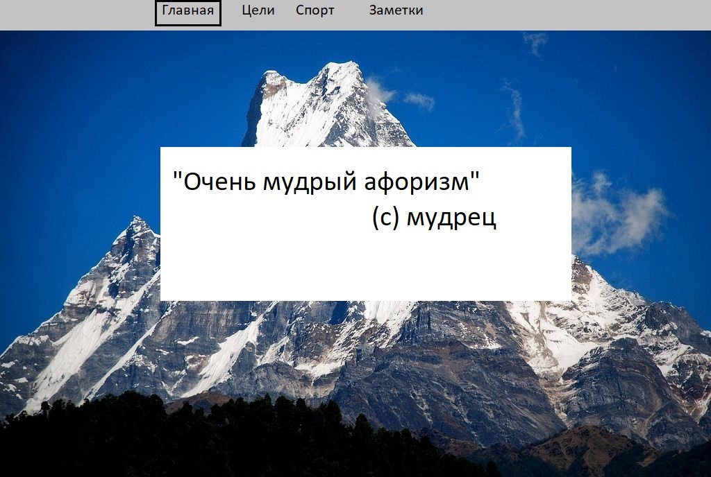
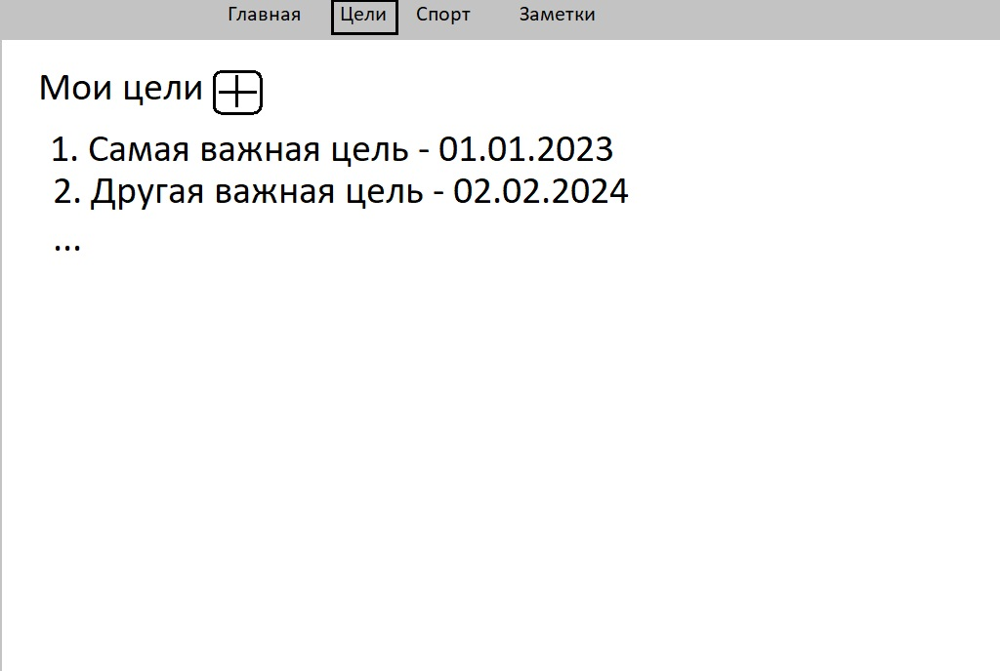
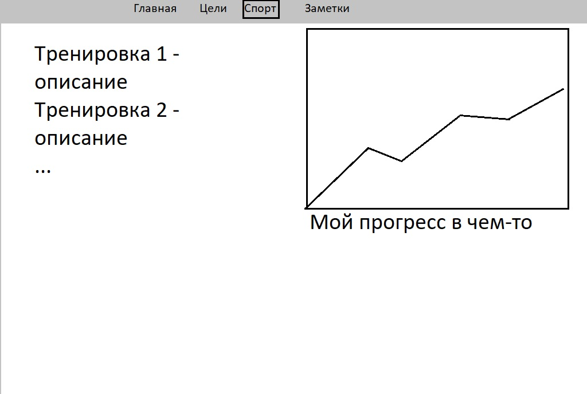

# Work your ass off!

*Александр Блажков, M33001*

Проект по дисциплине "Web-программирование", который нужен каждому.

## Описание проекта
Проект представляет собой web-приложение для учета тренировок, личностного становления и роста. Это место для пребывания наедине с собой.

### Основные тематические части приложения
- Главная
- Цели
- Спорт
- Размышления

### Главная

### Цели

### Спорт

### Размышления

